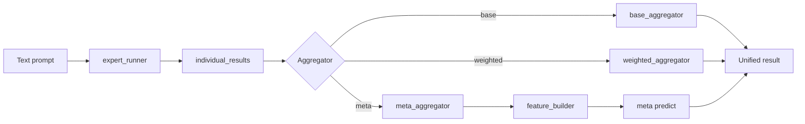
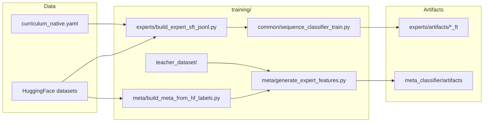

# Army of Safeguards

A modular research stack of **safeguard experts** (specialized detectors for toxicity, sexual/sensitive content, jailbreak attempts, and factuality) plus **aggregators** that fuse expert outputs into a single safety verdict. Optional **meta-classifiers** learn a policy over expert probabilities; **benchmarks** and **training** tooling live in-repo.

## Architecture

High-level runtime path: text passes through parallel **experts**, then an **aggregator** (threshold, weighted sum, or learned meta-model) produces `is_safe`, confidences, and per-expert `individual_results`.



`expert_runner` invokes the four heads in **experts/** (factuality, toxicity, sexual, jailbreak) and packs their outputs into `individual_results`. Runtime selects **one** aggregator. The **meta** path maps those features through `meta_classifier` before returning the same style of result as base/weighted.

Offline **data and training** flow (native labels, expert-Q features, meta training):



## Components

| Area | Role |
|------|------|
| [`experts/`](experts/) | Per-head `predict()` / `predict_batch()`; load DeBERTa (or similar) checkpoints; env overrides like `AOS_TOXICITY_MODEL`. |
| [`aggregator/`](aggregator/) | `expert_runner` batches all experts; `base` / `weighted` / `meta` aggregators map logits to a unified verdict. |
| [`meta_classifier/`](meta_classifier/) | Feature vectors from `individual_results`, logistic or tabular models, calibration; `AOS_META_MODEL_PATH`. |
| [`policy/`](policy/) | Triage and dynamic thresholds. |
| [`rules/`](rules/) | Optional rule engine hooks. |
| [`evaluation/`](evaluation/) | Public HF benchmarks via `run_benchmark.py`. |
| [`training/`](training/) | SFT entry points per expert, meta JSONL builders, shared `hf_datasets.load_hf_split`. |

## Project layout

```
ArmyOfSafeguards/
├── experts/              # Safeguard models (factuality, toxicity, sexual, jailbreak)
├── aggregator/           # expert_runner + base / weighted / meta aggregators
├── meta_classifier/      # Features, train_meta, predict, artifacts
├── policy/               # Triage and thresholds
├── rules/                # Optional rules engine
├── wrappers/             # env, logging, shared utils
├── evaluation/           # Benchmark harness (HF datasets)
├── benchmark/            # Shim to evaluation/run_benchmark.py
├── training/             # SFT, meta JSONL, teacher_dataset, common/
├── docs/                 # Design notes
├── requirements.txt
└── README.md
```

## Documentation and entry points

- **Training & SFT:** [`training/README.md`](training/README.md)
- **Benchmarks:** [`evaluation/README.md`](evaluation/README.md)
- **Meta labeling schema:** [`docs/meta_training_labeling.md`](docs/meta_training_labeling.md)
- **Expert status:** [`docs/experts_training_status.md`](docs/experts_training_status.md)

## Getting started

```bash
git clone https://github.com/SohamNagi/ArmyOfSafeguards.git
cd ArmyOfSafeguards
python -m venv venv
# Windows: venv\Scripts\activate
pip install -r requirements.txt
```

Run the unified aggregator CLI:

```bash
python aggregator/aggregator.py "Your text to evaluate"
```

## Requirements

- Python 3.9+
- PyTorch and Hugging Face `transformers` / `datasets` (see [`requirements.txt`](requirements.txt))
- For gated Hub datasets or models: `huggingface-cli login` or `HF_TOKEN`

## License

TBD.
